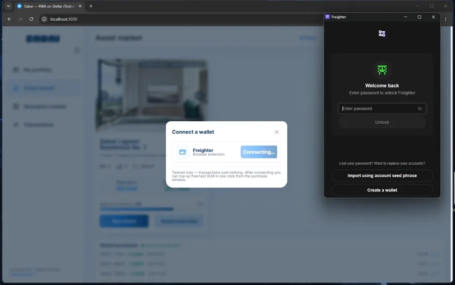
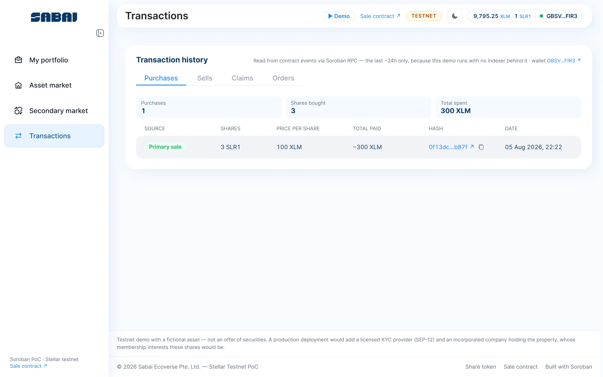

# Sabai — Fractional Real-World Assets on Stellar

Buy a fractional share of a tokenized property, sell it back, trade it peer to
peer, collect rental income. End to end on **Stellar testnet**, five Soroban
contracts, no backend.

[](https://sabai-stellar.vercel.app)
[](https://developers.stellar.org/docs/build/smart-contracts/overview)
[](https://crates.io/crates/soroban-sdk)
[](../../actions/workflows/ci.yml)
[](contracts)
[](https://nextjs.org)
[](LICENSE)

> **Testnet demo, not an offering.** "Sabai Lagoon Residence No. 1" is a
> fictional property. No securities are offered, no ownership is conveyed and no
> personal data is collected. The eligibility gate is enforced on-chain; the KYC
> decision behind it is simulated.

## Watch it work



The full **3:07 walkthrough** is [`web/public/media/demo.webm`](web/public/media/demo.webm)
([H.264 copy](web/public/media/demo.mp4) for Safari), and the **▶ Demo** button
in the app's header plays it in place. One take, against
this deployment: connect Freighter, top up from friendbot, pass the eligibility
gate, buy three shares, claim a rent round, sell one back to the buyback pool,
list one on the secondary market, read all four tabs of the history back out of
the contract events, and open the last transaction on a public explorer.

Every approval in it is the real Freighter extension and every transaction is
on the ledger — the clip above is the wallet's own window beside the app's, not
a mock-up of one. The hashes on the closing screen are live; **[Verify it
yourself](#verify-it-yourself)** below is how to open them on a public explorer
and check the rest without trusting any of this.

## Try it in three minutes

**[sabai-stellar.vercel.app](https://sabai-stellar.vercel.app)** is this
repository's `web/` deployed from `main` against the same testnet contracts, so
there is nothing to install to look around. To run the identical thing locally:

```bash
git clone https://github.com/sabaiprotocol/sabai-stellar.git
cd sabai-stellar && npm install && npm run dev -w web    # localhost:3030
```

The app already points at the live testnet contracts below. Install
[Freighter](https://freighter.app), switch it to testnet, then in the UI: fund
your account from friendbot, pass the demo KYC, buy a share. Every screen reads
from Soroban RPC at request time, so anything it shows can be checked on
[stellar.expert](https://stellar.expert/explorer/testnet) in one click.

## What it does

| Flow | What happens on-chain |
| --- | --- |
| **Get admitted** | Until the compliance registry lists your address, nothing moves - not a purchase, not a trade, not a wallet-to-wallet transfer, because the share token asks the registry on every movement of shares. In production only the KYC provider's key writes that list. |
| **Buy shares** | XLM to the treasury, `SLR1` shares to your wallet, one atomic invocation, one signature, no approve step. `max_cost` bounds what a repricing can charge you. |
| **Sell back** | The issuer funds a buyback pool and repurchases 5% below the primary price, so a holder can exit without waiting for a counterparty. The discount is fixed at deployment and has no setter. |
| **Trade peer to peer** | List at your own price inside an admin-set band; anyone eligible fills part or all of it. Shares sit in contract escrow while listed, the platform takes 2% per fill. |
| **Claim income** | The issuer deposits a round; every holder pulls their pro-rata slice whenever they want. Both markets put a buyer on the distributor's books inside the purchase, so nothing extra is asked of them. Rounds distributed before you owned the shares are not yours, which is also what stops the same shares being paid twice as they change hands. |

There is no database, no indexer and no API server anywhere in this repository.
Delete the frontend and every rule still holds, which is the point of putting
them in contracts rather than in an API.

| | |
| --- | --- |
|  |  |
| **Asset market** — price, inventory and the purchase feed, each read from the sale contract at request time | **Secondary market** — the live order book out of the exchange contract, sellers and prices as they stand |
|  |  |
| **On-chain** — every contract the page depends on, with the sha256 of the wasm it is running | **The anchor** — `terms()` read live: the issuing entity, the governing law, and the sha256 of the documents in [docs/legal/](docs/legal/) |
|  |  |
| **Portfolio** — a real holder: 2 shares, 1 of them escrowed in an open order and earning nothing while listed, and a rent round already claimable without a second transaction | **History** — reconstructed from contract events through RPC, one tab per kind of event, one row per transaction, each linking to the ledger |

The first four need no wallet at all: no session, nothing cached, everything on
them came from Soroban RPC when the page loaded. The last two are the throwaway
testnet wallet from the walkthrough above, which registered, bought three shares
from the primary sale, claimed a round, sold one back to the buyback pool and
listed one on the exchange — all of it on-chain, all of it reachable from the
hashes in the screenshot.

## What makes it a security token rather than a coin

The six properties below are what a regulated issuer actually has to be able to
demonstrate, and each one is a contract rule rather than an operating promise.
`npm run compliance-drill` and `npm run governance-drill` exercise them against
the live deployment and fail if any control lets a transaction through — or
fails to release it again.

**The supply is issued once.** `mint` runs exactly one time and cannot exceed the
cap fixed at deployment. A building has the share count it has; a second
issuance would dilute every holder and quietly make the rent maths wrong,
because `rewards-distributor` divides income by that same fixed number. Supply
can only fall after that, through `burn`.

**Issuance and inventory are separate.** The shares are minted into the
treasury, and funding the sale contract is a second transaction signed by the
treasury key. The key that can issue cannot put the supply up for sale on its
own, and whatever is not offered never reaches the sale contract's reach.

**One transaction halts everything.** `compliance-registry.pause` stops minting,
transfers, purchases, buybacks, listings and fills across all five contracts —
none of which contain any pause logic of their own, because every write already
asks the registry whether an address may hold shares. Rent already earned stays
claimable throughout: halting an asset is not the same as withholding a holder's
money.

**Suspension, revocation and confiscation are three different things.** The KYC
provider can `freeze` a verified investor (blocked, verification intact, rent
still accruing, lifted with one call) or `revoke` them entirely (the KYC
decision itself withdrawn). Separately the admin can `revoke_shares`, moving
shares out of an address that will not or cannot sign — a court order, a probate
transfer, lost keys. That last one is bounded: the destination is the treasury
address fixed at deployment with no setter, so the key that can confiscate
cannot choose where the shares land, and every confiscation publishes
`shares_revoked` next to the standard `transfer` so it can never read as a trade.

**No single key can do any of it.** The admin of all five contracts is a
**2-of-3 multisig Stellar account** — three signers, medium threshold 2, master
key weight 0 — and a separate hot **operator** key runs the asset day to day.
The operator can halt the deployment and switch the markets; it cannot move a
share, change a price, withdraw anything or promote itself, and it cannot lift a
halt, because stopping is the cheap direction to be wrong in. That is account
multisig, enforced by the network on every transaction the account sources — no
Safe-equivalent contract to deploy or audit, and the signers are visible on any
explorer. `npm run governance-drill` proves each of those on-chain, including
that one signature out of three is refused and two are accepted.
See **[docs/GOVERNANCE.md](docs/GOVERNANCE.md)**.

**The token points at the paperwork, and the paperwork exists.**
`share_token.terms()` carries the issuing entity, the jurisdiction, a URI and the
**sha256 of the anchored bundle**, so an agreement quietly edited after investors
signed no longer matches what the ledger recorded. The bundle is not a
placeholder: **[docs/legal/](docs/legal/)** is a reference document set drafted
around these contracts — framework license, articles, operating agreement,
subscription agreement, risk factors, platform terms, operating policy, listing
agreement — and its four constitutional documents are the ones the register
anchors. Two commands agree or one of them is stale:

```bash
cat docs/legal/0[3-6]-*.md | sha256sum
stellar contract invoke --network testnet \
  --id CAAYJPFOVUHSQJEJA5G3WBBZRNX7GAYTT2C2IJG6TYB7RZCPRN3ZC4XQ -- terms
```

On this deployment `is_real_asset` is `false` — the contract says it is a
demonstration in a field a wallet can read, not only in a disclaimer. What would
have to exist for it to be `true` is spelled out in
**[docs/LEGAL-STRUCTURE.md](docs/LEGAL-STRUCTURE.md)**.

## The legal layer, clause by entrypoint

The pack's point is that its operative clauses are not promises. Each one names
the mechanism that executes it, and the ones that have no mechanism yet are
listed as such rather than left to be discovered:

| Legal rule | Enforced by |
| --- | --- |
| The member register, in real time | `share-token` balances — the operating agreement makes them definitive, with no paper register controlling over them |
| Only verified non-U.S. persons hold or receive units | `compliance-registry`, both sides of every movement — which is also the Regulation S stop-transfer |
| Fixed capital: 1,000 units, never recalculated | one-shot `mint` under an immutable cap |
| Distributions pro rata, post-tax | `rewards-distributor` — deposits leave only through a holder's own claim |
| Forced transfer on court order, probate, lost keys | `revoke_shares`, destination fixed at deployment |
| Suspension on a sanctions or compliance event | `freeze` / `unfreeze`, the provider's key only |
| Incident halt without touching earned income | registry `pause`; `claim` deliberately stays open |
| The documents themselves, tamper-evident | `set_terms` — URI plus sha256 on the ledger |
| **9.99% concentration cap, member-count limit** | **platform procedure** — needs the compliance module |
| **Subscriptions escrowed until Final Closing** | **platform procedure** — same |
| **Proposal voting** | **off-chain against an on-chain register snapshot, by design** |

Three tiers stand behind that: Sabai Ecoverse licenses the framework and holds
no keys in any deployment; an operator company the client incorporates runs the
platform inside its own regulatory perimeter; and one Wyoming DAO LLC per asset
is the issuer, so the liabilities of one asset never reach another. Reasoning
and the road to mainnet: **[docs/legal/](docs/legal/)** and
**[docs/legal/01-COMPLIANCE-ROADMAP.md](docs/legal/01-COMPLIANCE-ROADMAP.md)**.

## Where the comparison numbers come from

The same flows — eligibility gate, primary sale, buyback, secondary market,
income distribution — exist as Solidity contracts deployed by
[Sabai Protocol](https://sabaiprotocol.com) on Polygon. That deployment is what
the Polygon column of every table in this repository is read from: real mainnet
transactions on contracts implementing the same product, not a benchmark
harness and not an estimate.

So the question this repository asks is a narrow, technical one: what these
flows look like rebuilt natively on Stellar, and what the move costs and gains
per operation, measured on both chains rather than modelled.

## Why Stellar, in three numbers

Measured from **2,285 real Polygon mainnet transactions** across five live
Sabai assets, against `feeCharged` on this deployment. Full tables, methodology
and per-transaction links: **[docs/WHY-STELLAR.md](docs/WHY-STELLAR.md)**.

- **Income distribution stops scaling with holders.** Paying out one round on
  Polygon means pushing to every holder in batches: **189** `addRewardsGroup`
  transactions in this window, largest batch **1,595,393 gas**, driven by a
  backend that keeps the holder list. That one operation ate a third of all the
  gas these five assets spent. Soroban needs one `deposit` (0.0023 XLM) whether
  the asset has 20 holders or 20,000, and keeps no holder list at all.
- **Predictability, not price.** The same Polygon operation cost between $0.0001
  and $0.0291 depending on the week: a **31x to 294x** spread per operation, and
  a buy alone swung 140x. Two consecutive warm runs of the whole Soroban
  lifecycle landed within **0.09%** of each other, and five of the nine
  operations were bit-identical. Soroban prices the resources a transaction
  touches, and simulation returns the number before the investor signs. At
  today's prices Stellar is *not* uniformly cheaper: buying costs about 4x what
  it does on Polygon, because a purchase here also does the reward-accounting
  work Polygon's backend does off-chain.
- **One signature instead of two.** `require_auth` authorizes the exact
  sub-invocation inside one transaction, so ERC-20's `approve` + call collapses
  into a single prompt. Three of the measured flows lose a signature, and a
  fourth was removed outright: both markets settle a buyer's reward position
  inside the purchase rather than leaving them a second transaction to send.

## Contracts

| Contract | Address | Owns |
| --- | --- | --- |
| `compliance-registry` | [`CBNLW6LX…FZ6J`](https://stellar.expert/explorer/testnet/contract/CBNLW6LXBXALOBF3OQ2SAY2JVKP5YFN5VPKWM663FO3OCT5YXKGIFZ6J) | who may hold shares — **one per platform, shared by every asset** |
| `share-token` | [`CAAYJPFO…C4XQ`](https://stellar.expert/explorer/testnet/contract/CAAYJPFOVUHSQJEJA5G3WBBZRNX7GAYTT2C2IJG6TYB7RZCPRN3ZC4XQ) | `SLR1` balances, 1000 indivisible shares, the transfer-time gate |
| `asset-sale` | [`CCJXESXD…WD7J`](https://stellar.expert/explorer/testnet/contract/CCJXESXDL7EDQQJ53MVQDEBYIXNQLLD27RKWGNE5LPOQL45Q6CTGWD7J) | price, primary sale, buyback pool |
| `asset-exchange` | [`CA7RAEYC…L7EV`](https://stellar.expert/explorer/testnet/contract/CA7RAEYCZSQL2GWHSIOZNLBWUVJJYAC4GUUGT535HVC5A6GHFLAUL7EV) | escrowed sell orders, price band, 2% commission |
| `rewards-distributor` | [`CCEH6S5P…WPSN`](https://stellar.expert/explorer/testnet/contract/CCEH6S5P7T2JZDD5EIDKEL3ZAYVPVHD4JFYRLXSVNPXYAB2D775RWPSN) | income per share, per-holder claim accounting |
| native XLM SAC | `CDLZFC3S…CYSC` | payment asset, built into the protocol, not our code |

Addresses, wasm hashes and configuration live in
[`deployments/testnet.json`](deployments/testnet.json), written by the deploy
script and read by both the app and the scripts. No address is hardcoded
anywhere else.

**Who can call what**

| Contract | Anyone | Holder | Operator *(hot key)* | Admin only *(2-of-3)* |
| --- | --- | --- | --- | --- |
| `compliance-registry` | `register` *(demo shortcut)* | — | `pause` | `resume`, `set_participant`, `set_kyc_provider` |
| `share-token` | — | `transfer`, `approve`, `burn`, … | — | `mint` *(once)*, `revoke_shares` *(to the treasury)*, `set_terms` |
| `asset-sale` | `fund_buyback` | `buy`, `sell` *(eligible)* | `set_available` | `set_price`, `withdraw_buyback`, `withdraw_shares`, `set_rewards` |
| `asset-exchange` | — | `add_order`, `swap_order` *(eligible)*, `close_order` *(own order)* | `set_available`, `close_order_by` | `set_rewards` |
| `rewards-distributor` | `settle` *(moves no money)* | `claim` | `deposit` | — |
| all five | — | — | — | `upgrade`, `set_operator`, `transfer_admin` |

The operator's three money-adjacent powers are on that list because none of them
can take anything: `deposit` moves XLM **into** the reward pool and that contract
can only pay it out to a holder claiming; `close_order_by` returns escrow to its
seller and nowhere else; `set_available` stops trade while `sell` and
`close_order` stay open, so a closed market never traps a holder. `set_price` is
admin-only for the mirror reason — a price of one stroop empties the inventory
into whoever notices first.

`register_verified`, `register_verified_batch`, `freeze`, `unfreeze` and `revoke`
sit outside that table because they belong to a fourth party: only the address
stored as `kyc_provider` may call them. That key is separate from both the admin
and the operator, and it does exactly one thing — decide who is eligible. It
cannot move funds, change the price, halt anything, or grant itself any other
power.

The admin cannot write the investor list either. Note the exact scope:
eligibility is `investor OR participant`, and `set_participant` is admin-only
with no check that the address belongs to a contract, so an admin *can* make an
address eligible by admitting it as infrastructure. The two are different
storage maps written by different keys and emitting different events, so the log
always shows which happened; making the distinction enforceable rather than
visible needs an identity claim on the entry, which is the compliance-module
work in the roadmap.

**The gate is in the token, not only in the markets.** `share-token` asks the
registry on every `mint`, `transfer` and `transfer_from`, for both sides of the
movement. A holder cannot hand shares to an uncleared address, an approved
spender cannot deliver them there either, and a revoked holder keeps what they
own but can no longer move it. Enforcing eligibility only in the sale and
exchange contracts would leave a plain wallet-to-wallet transfer as the way
around all of it.

`share-token` implements Soroban's standard `TokenInterface`, the SEP-41 surface
the native XLM SAC also exposes, so any wallet or explorer that speaks it can
read and move `SLR1` knowing nothing about this project.

**Where the ecosystem standards actually stand**, because "SEP-12" appearing in
a document is not the same as an integration:

| | Status |
| --- | --- |
| **SEP-41** token interface | **Implemented.** `share-token` exposes it; Freighter and stellar.expert read `SLR1` through it with no knowledge of this repository |
| **SEP-12** KYC, **SEP-10** web auth | **Designed, not integrated** — the flow and the message sequence are in [docs/KYC.md](docs/KYC.md). What is missing is a licensed provider, which is a contract to sign rather than code to write: the registry already reserves a `kyc_provider` key that only that party can use, so wiring one in is one `set_kyc_provider` transaction and deleting the demo's self-serve `register` |
| **SEP-24 / SEP-6** fiat ramps | **Roadmap.** Investors arrive with XLM today |

Saying so here rather than letting a reader discover it: the eligibility
*mechanism* is on-chain and drilled, the eligibility *decision* is simulated.

Errors are typed `contracterror` enums surfaced in the UI as sentences rather
than codes. Events are the entire history the app displays; addresses are
indexed as topics on both sides of a trade, so one `order_swap` feeds the
buyer's and the seller's history with the correct sign.

## Verify it yourself

Seven checks, none of which requires trusting this README.

**1. The state is real.** Open
[the sale contract](https://stellar.expert/explorer/testnet/contract/CCJXESXDL7EDQQJ53MVQDEBYIXNQLLD27RKWGNE5LPOQL45Q6CTGWD7J)
and compare `remaining` and `price` with what the app shows.

**2. Your own transaction is in the log.** Buy a share, then find your `buy`
event under the contract's events on the explorer: same amount, same address,
same ledger.

**3. The deployed code is the published code.**

```bash
cd contracts && stellar contract build
cd ../scripts && npm run verify-wasm
```

This reads all five contract instances from RPC and compares three values: the
wasm hash the network stores, the sha256 of the artifact you just built, and the
hash recorded in `deployments/testnet.json`. All three must agree. Build with
the pinned toolchain — Soroban embeds the contract spec, doc comments included,
in the wasm, so even a comment edit changes the hash.

**4. The compliance controls actually bind.**

```bash
cd scripts && npm run compliance-drill
```

Halts the deployment and proves a purchase and a listing both fail; suspends a
holder and proves their shares stop while their rent keeps accruing, then that
the suspension pays out in full when lifted; confiscates shares from an address
that never signs. Any control that lets its transaction through fails the run.

**5. Nobody here holds a key that can do everything.**

```bash
cd scripts && npm run governance-drill
```

Sends an admin call signed by one of the three signers and shows the network
refusing it with `txBadAuth`, then the same call with two signatures going
through. Halts the deployment with the operator key, fails to lift the halt with
it, lifts it with the admin quorum. Tries to reprice, withdraw, confiscate and
self-promote from the hot key, and fails at all four. Replaces a contract's code
and reads its roles, provider and participant list back unchanged. You can also
just look at the
[admin account](https://stellar.expert/explorer/testnet/account/GDGDXKNKTBLG7Q6AXIVPXY7VAUB4BQDLQS7CPBKDRPJPDWFMQPD43B4D)
— three signers of weight 1, medium threshold 2, master key weight 0.

**6. The rules hold without the UI.**

```bash
stellar contract invoke --id CCJXESXDL7EDQQJ53MVQDEBYIXNQLLD27RKWGNE5LPOQL45Q6CTGWD7J \
  --source-account <your-key> --network testnet -- remaining
```

Or try to break it: call `buy` from an address that never registered and the
network rejects it with `Error(Contract, #306)`, `NotWhitelisted`, because the
check is in the contract and not in the button. Error codes are unique across
the five contracts — registry 1xx, token 2xx, sale 3xx, exchange 4xx, rewards
5xx, governance 9xx — so a failure inside a cross-contract call always names the
contract that actually rejected it.

**7. The ledger points at the documents in this repository.**

```bash
cat docs/legal/0[3-6]-*.md | sha256sum
stellar contract invoke --network testnet \
  --id CAAYJPFOVUHSQJEJA5G3WBBZRNX7GAYTT2C2IJG6TYB7RZCPRN3ZC4XQ -- terms
```

`be85e1da2a35a09395f36857300e40d35af6075e4214da14cfefe12bf82a3af4` from both, or
one of them is stale. That is the whole value of anchoring a hash rather than a
link: edit one character of the operating agreement and the two stop matching,
and anyone can establish it without asking the issuer. Every version ever
anchored stays in the `terms_set` event history, so a holder can show which text
was in force the day they bought.

## Run it locally

| Tool | Version |
| --- | --- |
| Node | 24.18+ |
| Rust | 1.97+ with the `wasm32v1-none` target |
| Stellar CLI | 27.0 |
| Wallet | [Freighter](https://freighter.app) on testnet |

Deploying your own set of contracts is optional and needs a funded testnet key:

```bash
cp .env.example .env       # DEPLOYER_* and TREASURY_* at minimum
cd scripts
npm run setup-multisig     # generate any missing keys, build the 2-of-3 admin account
npm run deploy             # build, deploy 5 contracts, issue into custody, fund the sale
npm run bindings           # regenerate typed clients from the new wasm
npm run smoke-buy          # full lifecycle from a fresh wallet, prints the real fee table
npm run deposit-round      # distribute rent income to whoever holds shares now
npm run compliance-drill   # halt, suspend and confiscate, then release all three
npm run governance-drill   # prove one signature is not enough and the hot key is bounded
```

`setup-multisig` writes any keys it had to generate back into `.env` and prints
only the `G…` addresses — a secret on stdout ends up in terminal scrollback and
in any screen recording. Twelve of the deploy's fifteen steps are transactions
carrying two signatures.

The treasury needs its own secret, not just its address: the issuance is minted
to it and moving a tranche into the sale contract is signed by that key rather
than by the admin.

Admin calls are not in the dApp, because a browser wallet holds one signature
and they need two:

```bash
npm run admin -- resume            # lift a halt
npm run admin -- set-price 120
npm run admin -- transfer-admin G… # names a successor on all five contracts
npm run admin -- set-terms         # re-anchor docs/legal/03-06 after an amendment
```

`set-terms` takes no argument on purpose: it hashes the files in the working
tree, so what reaches the ledger is what a reader can check out, not a value
somebody typed.

Checks:

```bash
cd contracts && cargo fmt --all --check && cargo clippy --all-targets -- -D warnings && cargo test
cd web && npx biome check src && npx tsc --noEmit && npm run build
```

## Documentation

| Document | What is in it |
| --- | --- |
| [docs/ARCHITECTURE.md](docs/ARCHITECTURE.md) | What must be trustless versus what merely has to be available, and the production topology around this core |
| [docs/WHY-STELLAR.md](docs/WHY-STELLAR.md) | The full two-chain fee measurement, methodology and per-transaction links |
| [docs/KYC.md](docs/KYC.md) | The eligibility gate, the SEP-12 provider flow, and the known gaps |
| [docs/GOVERNANCE.md](docs/GOVERNANCE.md) | The four keys, the 2-of-3 admin account, what the hot key can and cannot reach, upgrades and handover |
| [docs/LEGAL-STRUCTURE.md](docs/LEGAL-STRUCTURE.md) | What has to exist off-chain before a share means anything: the structure chosen, the jurisdictions, the exemptions, and the document anchor |
| [docs/legal/](docs/legal/) | The reference legal pack itself — the ten documents of one deployment, with the entrypoint that enforces each operative clause |
| [docs/DESIGN-NOTES.md](docs/DESIGN-NOTES.md) | What is deliberately simplified, reviewer FAQ, roadmap to mainnet |
| [docs/DEPLOY.md](docs/DEPLOY.md) | Hosting the dApp: why `web/` cannot be built in isolation, the Vercel settings, the one environment variable |

## Repository layout

```
contracts/             Soroban contracts (Rust), 155 unit tests
  access/                the admin, operator and upgrade rules all five share
  compliance-registry/   who may hold shares, one instance for the whole platform
  share-token/           SLR1 balances and the transfer-time eligibility check
  asset-sale/            price, primary sale, buyback pool
  asset-exchange/        escrowed order book with a price band and commission
  rewards-distributor/   income per share, per-holder claims
scripts/               deploy, bindings, smoke test, wasm verification (TypeScript)
web/                   Next.js dApp: Freighter, Soroban RPC, no backend
packages/bindings/     generated typed clients, committed so the app builds without Rust
deployments/           testnet.json: addresses, wasm hashes, roles, configuration
docs/                  architecture, fee measurement, KYC, governance, legal structure, hosting
  legal/                 the reference legal pack; 03-06 are what the ledger anchors
  screenshots/           the six screens the README shows, plus the animated clip
.github/workflows/     CI: fmt, clippy, tests, wasm build, biome, tsc, bindings, next build
```

| Script | Where | What |
| --- | --- | --- |
| `npm run setup-multisig` | `scripts/` | Build the 2-of-3 admin account: three signers, medium threshold 2, master key weight 0 |
| `npm run deploy` | `scripts/` | Build, deploy all five contracts, issue the shares, seed the demo state |
| `npm run redeploy` | `scripts/` | Restore everything after a testnet reset: re-fund, rebuild the multisig, deploy |
| `npm run upgrade` | `scripts/` | Replace the code of live contracts in place, 2-of-3, keeping their addresses and state |
| `npm run admin -- <cmd>` | `scripts/` | The admin calls, signed by a quorum: `resume`, `set-price`, `withdraw-buyback`, `transfer-admin`, `set-terms` |
| `npm run bindings` | `scripts/` | Regenerate typed clients from the built wasm |
| `npm run smoke-buy` | `scripts/` | Full lifecycle from a fresh funded wallet, prints real fees |
| `npm run seed-demo` | `scripts/` | Distribute shares to a spread of real holders, open a book, fund the buyback, pay a rent round |
| `npm run compliance-drill` | `scripts/` | Prove the halt, the suspension and the forced revocation all bind |
| `npm run governance-drill` | `scripts/` | Prove one admin signature is refused, two are accepted, and the hot key is bounded |
| `npm run deposit-round` | `scripts/` | Distribute one round of rent income to current holders |
| `npm run verify-wasm` | `scripts/` | Compare repository, local build and on-chain wasm hashes |
| `npm run dev` | `web/` | Dev server on port 3030 |
| `npm run lint` | root | Biome across the workspace |

## Security

Testnet only, so no real value is at risk. Even so, please report anything you
find privately to **security@sabaiprotocol.com** rather than opening a public
issue.

Never commit `.env`. It holds every key in the deployment, including all three
admin signers — which is the demo half of this setup and the one thing about it
that is not a design. Real 2-of-3 means two people, two machines and the
transaction XDR travelling between them; the contracts cannot tell the
difference, and the operational practice is what makes it real.

The scripts mask any `S…` seed in what they print **and** in what they throw: a
failed CLI call would otherwise surface Node's
`Command failed: stellar … --source-account S…` straight into the terminal, CI
output and any screen recording of a deploy. `setup-multisig` generates missing
keys straight into `.env` and prints only the `G…` addresses, for the same
reason.

Seeds are still passed to the Stellar CLI as arguments on the deploy path, so
they are visible to anything that can read the process table. Acceptable for
testnet keys on a workstation; a mainnet deployment signs from hardware. CI
holds no secrets and touches no network — see
[`.github/workflows/ci.yml`](.github/workflows/ci.yml).

## License

MIT, see [LICENSE](LICENSE) — that covers the code in this repository.

[docs/legal/](docs/legal/) is different. It is reference documentation of the
framework, published for review and evaluation; the document templates stay part
of the licensed framework rather than passing under MIT. Every document in it is
a **specimen** and says so in its header: the operator and the per-asset company
are illustrative, Sabai Ecoverse Pte. Ltd. is the one real party, and none of it
is legal advice. Legal notices for this repository and the demo itself are in
[docs/legal/10-TERMS.md](docs/legal/10-TERMS.md).
