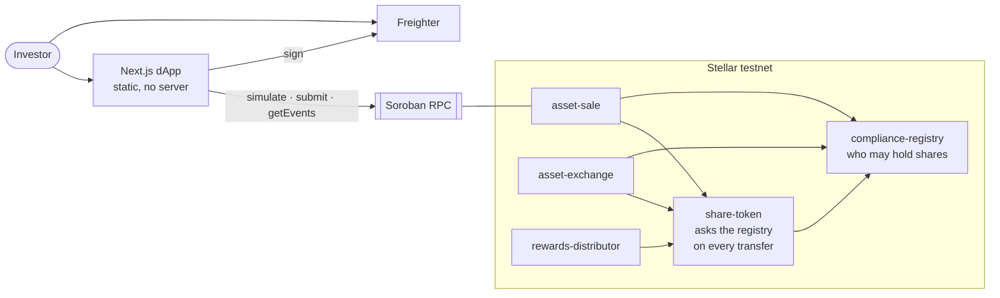
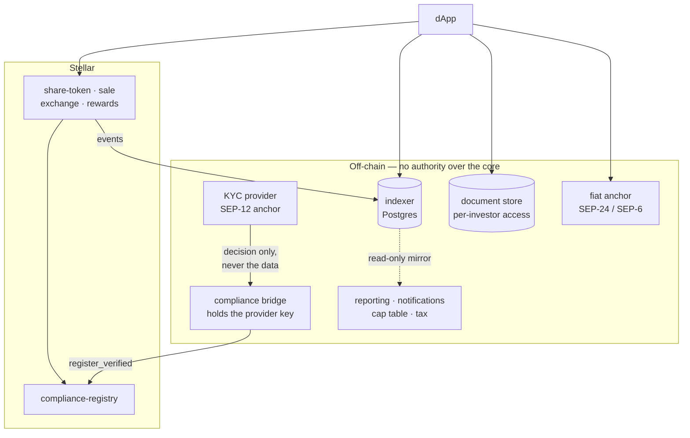

# Architecture: what belongs on-chain, and what a production deployment adds

The PoC has no backend. That is a property of the demonstration, not a claim
that a production platform needs no servers. This document draws the line we
actually use: **what must be trustless, versus what merely has to be
available.**

## The dividing line

| Must stay on-chain | Belongs off-chain |
| --- | --- |
| Who owns what | Personal data (KYC documents, identity) |
| Who is eligible to hold shares | Title deeds, SPV certificates, valuations |
| Settlement of a purchase or a trade | Search, filters, portfolio history, charts |
| Income entitlement and claims | History older than the RPC retention window |
| Order escrow and matching rules | Notifications, reporting, tax statements |
| Every privileged action, as an event | Fiat on and off ramps |
| | The process behind a price change |

The rule that keeps this honest: **no off-chain service holds authority over
the core.** If a backend decides who may trade, the token is not permissioned —
it is a database with a blockchain logo. Most of the shortcuts taken in this
industry are taken exactly there.

## Today: the PoC

Everything the interface shows is read from RPC at request time. Delete the
frontend and every rule still holds — which is the point of putting them in
contracts rather than in an API.

The honest cost of having no backend is visible in the app: the activity feed
covers roughly the last 24 hours, because that is what public RPC retains and
there is nothing else remembering.

## Production: the same core, with services around it

**KYC provider.** The investor's data goes to a licensed vendor, never to us
and never on-chain. Two shapes work: the vendor runs the SEP-12 anchor and
signs `register_verified` itself, or a thin bridge on our side receives the
decision — a boolean and a reference id, not the documents — and signs. The
second is what is realistic today. Either way the signing key can admit
investors and do nothing else, which is enforced by the contract, not by the
service. See [KYC.md](KYC.md).

**Indexer.** Needed, and not optional at scale. Public RPC retains events for
about a week; there are no historical queries, no aggregation, no per-user
filtering. An indexer follows ledgers, decodes our contract events and writes
them to Postgres. It is a **read cache of the chain and must never be
authoritative**:

> read from the chain everything the user *acts on*; read from the indexer
> everything the user *browses*.

Balance before signing, order state at fill time — chain. Portfolio over time,
charts, history, search — indexer. The contract re-validates on submission
regardless, so a stale index can inconvenience a user but cannot corrupt state.

The same argument applies to the order book: `orders()` returning the whole
book in one call is a PoC affordance. A production book is discovered through
the indexer and settled by contract id against the contract.

**Document store.** Title deeds, SPV certificates and valuations live in
object storage with access granted per investor and per KYC status. Put the
document hash on-chain if tamper evidence matters; the file itself never goes
there.

**Fiat ramps.** SEP-24 and SEP-6 anchors, so an investor can arrive with money
rather than with XLM. A vendor service again.

**Price and appraisal.** The action is on-chain (`set_price`), the process is
not: third-party appraisal, an approval workflow, and a multisig signing the
resulting transaction.

## Why this is not a redesign

Our Polygon deployment already has exactly this shape — a backend bot writes
the whitelist, a server holds the documents, the contracts hold ownership and
settlement. What changes on Stellar is the core, not the topology around it.

## Contract topology per asset

One registry serves the whole platform. Everything else is per-asset:

| Contract | Scope | Why |
| --- | --- | --- |
| `compliance-registry` | **one per platform** | an investor verified once can hold any asset — on Polygon the same person is whitelisted separately per asset |
| `share-token` | per asset | the shares *are* the asset |
| `asset-sale` | per asset | price, inventory and buyback pool are asset-specific |
| `asset-exchange` | per asset | isolates one asset's order book from another's |
| `rewards-distributor` | per asset | income per share of *that* property |

Issuing a second asset means deploying four contracts and pointing them at the
existing registry. That is cheap on Soroban: the wasm is uploaded once and
identified by hash, and each deployment is a new *instance* referencing the
same code — deploying by `--wasm-hash` skips the upload entirely. Contract code
is not copied per instance the way EVM bytecode is.
