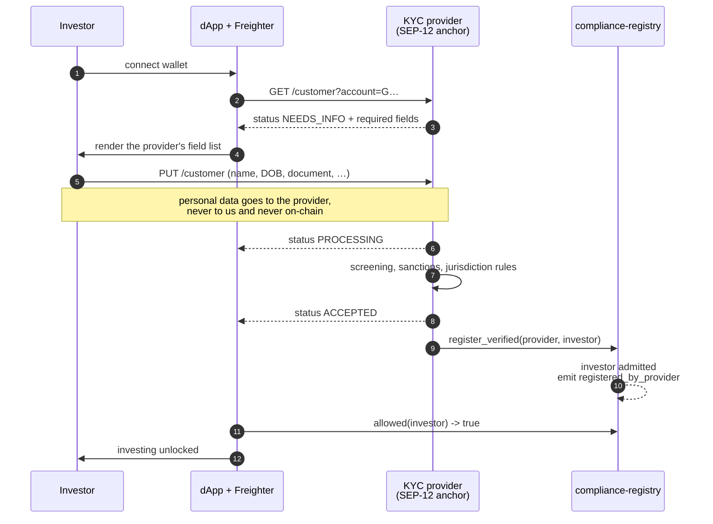

# Investor eligibility: the on-chain gate and the provider behind it

Nothing moves shares in this PoC unless the `compliance-registry` contract lists
the address. This document covers where that list is written from, what already
exists in the contracts, and what is deliberately simulated.

## What is already in the contract

The registry holds two separate maps and two separate roles.

| Entrypoint | Who may call it | Purpose |
| --- | --- | --- |
| `register_verified(provider, user)` | only the stored `kyc_provider` | the production path: admits an investor after an off-chain decision |
| `register_verified_batch(provider, users)` | only the stored `kyc_provider` | the same, for up to 100 addresses cleared in one review run |
| `freeze(provider, user)` / `unfreeze` | only the stored `kyc_provider` | suspends a verified investor without withdrawing the verification |
| `revoke(provider, user)` | only the stored `kyc_provider` | withdraws eligibility after a sanctions hit, an expiry, a closed account |
| `register(user)` | the investor themselves | demo shortcut, so the flow is walkable without a KYC vendor |
| `set_participant(addr, allowed)` | only `admin` (2 of 3) | admits a protocol contract that has to hold shares |
| `set_kyc_provider(provider)` | only `admin` (2 of 3) | rotate providers without redeploying |
| `pause(caller)` | `admin` or `operator` | halts every movement of shares across the whole deployment |
| `resume()` | only `admin` (2 of 3) | lifts it again — a narrower list than `pause` on purpose |

The provider check runs before `require_auth`, so a stranger gets
`NotKycProvider` rather than a confusing authorization failure:

```rust
fn require_provider(env: &Env, provider: &Address) {
    let expected: Address = get(env, &DataKey::KycProvider);
    if provider != &expected {
        panic_with_error!(env, Error::NotKycProvider);
    }
    provider.require_auth();
}
```

Three consequences worth stating plainly:

- **The provider's power is exactly one thing.** It admits, suspends and revokes
  investors. It cannot move funds, issue shares, change the price, halt the
  deployment, cancel an order, or admit a contract.
  `provider_cannot_touch_admin_powers` signs as the provider and asserts every
  admin entrypoint - `pause` included - still refuses.
- **The admin cannot write the investor list.** `register_verified` and
  `revoke` check the caller against the stored `kyc_provider` and nothing else.
  Note the precise scope: eligibility is `investor OR participant`, and
  `set_participant` is admin-only with no check that the address belongs to a
  contract, so an admin *can* make an address eligible by admitting it as
  infrastructure. The two are different storage maps written by different keys
  and emitting different events, so the log always shows which happened. Making
  the distinction enforceable rather than visible needs an identity claim on
  the entry, which is the compliance-module work in the roadmap.
- **The two registration paths emit different events**, `registered` and
  `registered_by_provider`. They are not interchangeable in an audit, and the
  self-serve one does not exist in a production deployment.

On this testnet deployment the provider is a separate funded key from the
deployer, so the separation is visible on-chain rather than merely described
here. `npm run smoke-buy` admits its second buyer through `register_verified`.

## What the gate actually covers

The registry is asked by `share-token` on every `mint`, `transfer` and
`transfer_from`, for **both sides** of the movement. Checking only in the sale
and exchange contracts would leave a plain wallet-to-wallet transfer as a way
around the whole thing.

Revocation freezes rather than confiscates. A revoked holder keeps their shares
and loses the ability to move or receive any.

## Suspension is not revocation

Two separate maps, and the difference matters to anyone reading the log later.

| | `freeze` | `revoke` |
| --- | --- | --- |
| What it says | this verified investor is blocked | the verification no longer stands |
| Typical cause | sanctions screening hit, court order, account under review | expired documents, closed account, provider withdrew the decision |
| Shares | frozen in place, both directions | frozen in place, both directions |
| Rent | keeps accruing, payout blocked, paid in full on release | keeps accruing, `claim` still works |
| To reverse | `unfreeze`, one call | `register_verified` again, after re-verification |

That row of the table is a legal commitment before it is a code path:
[the operating agreement](legal/04-OPERATING-AGREEMENT.md) §4.4 promises a
suspended member that entitlements keep accruing and are paid on release, and a
revoked one that accrued distributions stay claimable. Two different maps in the
registry are what make the promise keepable, and they publish different events
so the record shows which of the two happened.

`claim` in `rewards-distributor` asks the registry for `frozen`, not `allowed`,
and that choice is deliberate in both directions. A suspended holder must not be
paid, because a sanctions hit means the money stops. But the deployment-wide
halt must **not** reach the payout: stopping every holder from claiming rent
they have already earned is confiscation, not incident response. Asking the
narrower question is what separates the two.

## The halt

`pause` is the incident switch, and it lives here rather than in each contract
because this is the contract they all already consult. One admin transaction
makes `allowed` return false for every address, which stops minting, transfers,
purchases, buybacks, listings and fills across all five contracts at once - no
pause logic anywhere else, and no extra fee, since the call was already part of
every write.

The exception is `share-token.revoke_shares`, which does not consult the
registry at all. An incident is when a forced revocation is most likely to be
needed, and the address it targets is usually the one that was just frozen or
revoked, so a clawback that respected the gate would be useless in exactly the
case it exists for.

Shares already sitting in exchange escrow freeze too, in both directions. The
refund cannot go through because it is a transfer into the revoked address, and
`swap_order` refuses to fill the order because it checks the seller against the
registry as well as the buyer. Without that second check the escrow would be
the one gap in the gate: the shares leave from the exchange's own address and
the payment is a plain SAC transfer, so nothing else in the stack would ever
ask about the seller. Admitting them again releases both paths.

## What is simulated

The **decision**, not the mechanism. There is no licensed provider behind this
demo and no personal data is collected anywhere, deliberately: handling real PII
in a public testnet demo would be a liability, not a feature.

The pack takes the same position as a rule rather than a demo convenience.
[07-PLATFORM-TERMS.md](legal/07-PLATFORM-TERMS.md) §2 and
[05-SUBSCRIPTION-AGREEMENT.md](legal/05-SUBSCRIPTION-AGREEMENT.md) §7 both say
verification data stays with the provider and only the eligibility decision
reaches the ledger, and
[08-OPERATING-POLICY.md](legal/08-OPERATING-POLICY.md) §2 reserves the writing
of admissions, suspensions and revocations to the provider's key — the platform
administrators cannot admit an investor, which is the split
`provider_cannot_touch_admin_powers` pins down in the contract.

## Production flow (SEP-12)

[SEP-12](https://github.com/stellar/stellar-protocol/blob/master/ecosystem/sep-0012.md)
is Stellar's standard for exchanging KYC data between a client and an anchor.
The investor's data goes to the licensed provider; only the decision reaches the
chain.



Authentication for those calls is
[SEP-10](https://github.com/stellar/stellar-protocol/blob/master/ecosystem/sep-0010.md)
web auth: the investor proves control of their Stellar account by signing a
challenge transaction, and the provider issues a JWT scoped to that account. No
password, no account on our side.

## What changes when a real provider is wired in

| | Today | Production |
| --- | --- | --- |
| Registry writer | our provider key | licensed provider's key |
| Decision | self-serve or scripted | SEP-12 review by the provider |
| `register` entrypoint | present, for the demo | removed |
| Personal data | none collected | held by the provider, never by us, never on-chain |
| Rules encoded | eligible or not | plus jurisdiction, accreditation, sanctions, expiry |

The contract-side transition is one `set_kyc_provider` transaction plus deleting
the `register` entrypoint. Everything else stays, including every already
admitted investor.

## Known gaps

- **No expiry, and the TTL is not a substitute for one.** An entry persists
  until its storage TTL lapses, which is 90 days from the last write and is
  *not* extended by being read. What happens then is worth stating precisely,
  because it is not "the entry becomes false": an archived persistent entry
  makes the host reject any transaction that touches it until it is restored.
  So an investor who does not transact for 90 days does not quietly become
  ineligible - their calls start failing with an archival error instead of a
  clean `NotAllowed`. The direction is safe (nothing opens up by itself) but
  the failure is opaque, and the same applies to a suspension left in place
  that long. A production registry stores a valid-until ledger, enforces it in
  the check, and extends the TTL well past it so the two never interact — which
  is also what [08-OPERATING-POLICY.md](legal/08-OPERATING-POLICY.md) §2 assumes
  when it says a lapsed verification results in suspension until renewed. Today
  that sentence describes a person noticing rather than a contract deciding.
- **No jurisdiction or accreditation data on-chain.** The gate is a boolean, and
  four of the pack's rules need more than a boolean before the contracts can
  hold them: the 9.99% concentration cap and the member-count limit
  ([OA §4.6](legal/04-OPERATING-AGREEMENT.md)), per-jurisdiction eligibility
  ([platform terms §3](legal/07-PLATFORM-TERMS.md)), and verification expiry.
  All four are platform procedure until the compliance module ships — the
  sequencing is in
  [01-COMPLIANCE-ROADMAP.md](legal/01-COMPLIANCE-ROADMAP.md).
- **One provider at a time.** Several concurrent providers across jurisdictions
  would need a set rather than a single address.
- **The provider key is a single key.** The admin is already a 2-of-3 multisig
  account (see [GOVERNANCE.md](GOVERNANCE.md)); the provider is not, and in
  production it belongs to the licensed provider and should be theirs, for the
  same reasons.
